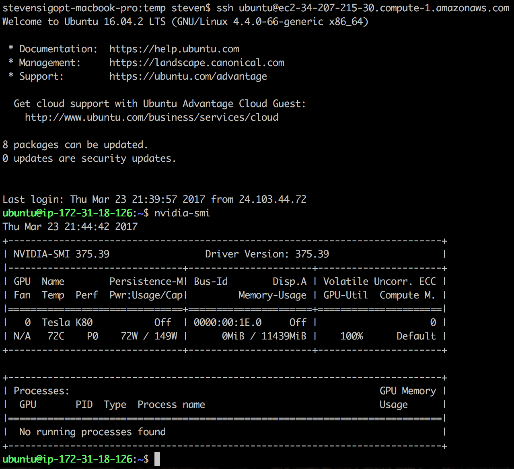

[](https://sigopt.com)

# Using SigOpt, NVIDIA, and MXNet to Tune Machine Learning Pipelines

Learn more at the associated blog post: [Fast CNN Tuning with AWS GPU Instances and SigOpt](https://aws.amazon.com/blogs/ai/fast-cnn-tuning-with-aws-gpu-instances-and-sigopt/).

_Limited Access: For those interested in replicating this blog post, let us know so that we can provide a SigOpt account for you beyond your free trial!_


## AWS Setup

This section will get the following up and running:

  > - OS: Ubuntu 16.04
  > - DNN Library: MXNet 0.9.3
  > - GPU Driver: CUDA 8.0, cuDNN 5.1
  > - GPU: NVIDIA K80 GPU
  > - Server: Amazon EC2’s P2 instances

1. Sign up for [Amazon Web Services](https://aws.amazon.com/).

2. This example is made for the US East (N. Virginia) region by selecting it from the dropdown menu on the top-right of the [EC2 Dashboard](https://console.aws.amazon.com/ec2/v2/home?region=us-east-1).

3. Create Key pair in the region you'll be spinning up your instance.
  - _Tip: To make it easier to ssh or scp using this keypair, add it to the authentication agent on your machine: `ssh-add /path/to/key.pem`_

4. Pick an instance type and image to be using. This example uses the `p2.xlarge` instance type, though really any [AWS EC2 P2](https://aws.amazon.com/ec2/instance-types/p2/) instance would work.

5. Get amazon instance up and running with sufficient storage. One simple way to do this is using and installing the [AWS CLI](https://aws.amazon.com/cli/) and entering the command below.

  - The community image SigOpt made and used to generate this example is _ami-193e860f_. (This image is based on [Ubuntu Cloud's Amazon EC2 AMI Locator](https://cloud-images.ubuntu.com/locator/ec2/) using image id _ami-2757f631_.)

  - ```
       aws ec2 run-instances \
	     --image-id ami-193e860f \
	     --instance-type p2.xlarge \
	     --key-name <key_name> \
	     --ebs-optimized \
	     --block-device-mapping \
	     "[ { \"DeviceName\": \"/dev/sda1\", \"Ebs\": { \"VolumeSize\": 32 } } ]"

6. Wait about a minute to access and reboot your instance.

  - If not operating on a private network, determine the _Public DNS_ of your instance. Otherwise, stick with a private hostname.
  - `ssh ubuntu@<hostname>`
  - A system restart seems to be requested by the OS most times when instantiating this image. `sudo reboot` to be safe.

7. Verify the NVIDIA GPU is up and running by entering `nvidia-smi`. You should see the status of the GPU driver as indicated below.



## Replicate Blog Post

1. Sign up for a SigOpt account .

8. Copy this repository over to your new MXNet + NVIDIA Ubuntu instance!
  - scp -r dnn-tuning-nvidia-mxnet/ ubuntu@<hostname>:/home/ubuntu

9. ssh back into your machine, install the SigOpt Python client:
  - `sudo pip install sigopt`

10. Add an API key as an environmental variable (get this from your [profile](http://www.sigopt.com/user/profile)):
  - `export SIGOPT_API_TOKEN=<YOUR_API_KEY>`

11. Run the example!
  - `cd dnn-tuning-nvidia-mxnet`
  - `python run_experiments.py`
  - `python run_experiments.py --with-architecture`
  - _Protip: Use nohup so you don't have to stay logged in._
    - `nohup python run_experiments.py &> logs-no-architecture.out &`
    - `nohup python run_experiments.py --with-architecture &> logs-with-architecture.out &`

12. Checkout your [experiment dashboard](http://www.sigopt.com/experiments) and view your experiment progress from anywhere!
  - As a reminder, we run useful analytics so you may start introspecting how your choice of hyperparameters impact your objective function.
